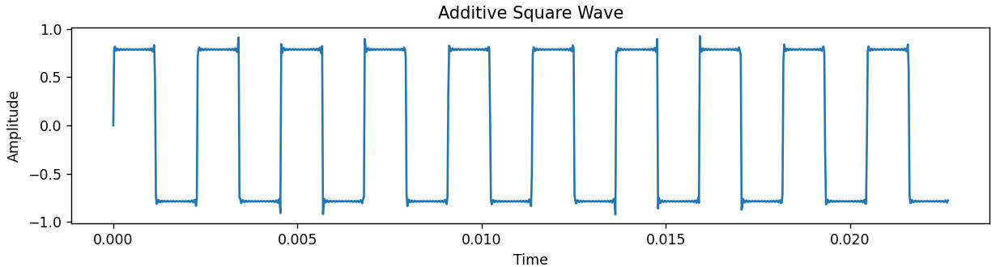
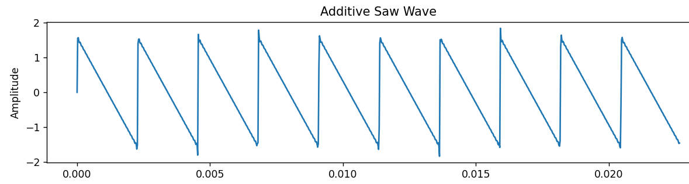
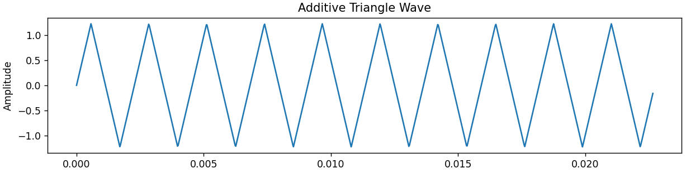

# 让 C++ 学会合成声音：从傅里叶级数到第一台软件合成器

在上一期节目当中，我们讲述了如何“让计算机理解声音”这个问题。但如果我们只能记录声音，那么计算机只能成为一个高级录音机，对于电子音乐，更重要的问题是：

如果没有真实的乐器，那么计算机能否从零创造出一个声音呢？

事实上，现代合成器的核心，就是通过数字建模的方式来创造出声音的。本期节目，我们将从数学公式的角度来探讨，如何从最基础的正弦波，通过数学方法构造复杂波形，并最终逐渐变成我们熟悉的波表。

你们是不是一听到数学公式，一听到傅里叶级数，就开始头疼了，但别担心，本期节目并不会为难大家，因此我会用尽量用通俗的语言去描述傅里叶级数，以及涉及到的数学公式。

## 什么是傅里叶级数

傅里叶级数，与傅里叶变换是互补的关系，如果傅里叶变换像是一台频谱分析仪，帮助我们发现声音里面隐藏了哪些频率成分，那傅里叶级数则是研究信号该怎么重新构成一个周期信号，怎么从最基础的正弦波组装成一个个复杂的周期信号，就是傅里叶级数所研究的，而加法合成就是典型的傅里叶级数的应用。

就比如一把小提琴的声波，用信号来拆解小提琴的波形，将小提琴的波形分析并拆解出一个个不同频率、不同振幅和不同相位的波形，就是对小提琴声音信号的傅里叶变换。然后我们根据手中已知的条件，来对正弦波形进行叠加，理论上能拟合出各种波形，这种操作就是傅里叶级数的一种。

到这里，就牵扯出一些问题出来：

1. 为什么是正弦波而不是其他类型的波形
2. 为什么通过叠加波形，理论上能合成任意的波形？
3. 这对我们合成常见的波形有什么帮助呢？

因此，我们针对以上问题一一回答。

## 为什么是正弦函数

在开始介绍加法合成之前，我们先回答一个问题：为什么计算机合成声音时，几乎总是从正弦波开始？

答案就藏在人们对自然振荡的研究当中。

首先严格来说，这里应该称为**正弦函数和余弦函数**，因为两者本质上只是相位不同：

$$
y=\cos\left(2\pi f t\right)=\sin\left(2\pi f t+\frac{\pi}{2}\right)
$$

高中数学告诉过我们，正弦函数与余弦函数在坐标系上几乎相同，它们本质上描述的是同一周期的周期运动，只是在时间轴上存在一个偏移，而神奇的地方在于：**正弦函数似乎天生就是为描述振动而存在的。**

在高中物理当中，我们学过简谐运动，这些系统最简单、最理想化的运动形式，都满足：

$$
x(t)=Acos(ωt+ϕ)
$$

也就是说，一个物体如果受到与位移成正比、方向相反的恢复力，它的运动轨迹天然就是正弦曲线。它正好就是正弦或余弦函数的形式。

但是，这还不是全部，真正让正弦函数特殊的是，它拥有一种近乎不可思议的性质：**求导之后，它依然保持自己的形态。**

$$
\frac{d}{dx}\sin(x)=\cos(x)
$$

$$
\frac{d}{dx}\cos(x)=-\sin(x)
$$

而我们也可以发现一个规律，对Sin不断求导，最终都会陷入一个循环

```
sin
 ↓ 求导
cos
 ↓ 求导
-sin
 ↓ 求导
-cos
 ↓ 求导
sin
```

这意味着很多事，在本期节目当中，位移，速度，加速度，本质上就是不断求导的关系。而对于正弦运动，位移、速度、加速度虽然大小不断变化，但始终保持同样的周期结构。而作为求导的“逆运算”的部分，求积分也是如此。

$$
∫sin(x)dx=−cos(x)
$$

于是，在自然界中，通过运算机械振动，最终能推导出争先运动，微积分运动能推算出正弦函数保持的自身运动形式，而在工程学当中，信号系统，也可以用正弦波来分析与运算了。

因此，傅里叶变换此时也提醒着我们：**任何复杂的周期信号，都可以分解为多个不同频率的正弦波。**

## 为什么理论上，可以合成任意的周期波形呢

如果正弦波只是一个简单的单频振荡，那么它为什么能够成为电子音乐的基础？答案就来自于傅里叶级数，傅里叶级数告诉我们：**一个满足一定条件的周期信号，可以被拆解为无数个不同频率的正弦和余弦波之和。**类似绘画中的三原色，一个复杂的颜料颜色，可以由红黄蓝混合而成，同样，一个复杂声音，也可以拆分成

```
440Hz + 880Hz + 1320Hz + ......
```

这些频率组合起来，就是声音的音色了。

### 为什么说是“理论上”呢

这里的“理论上”，并不是为了增加一个数学限定，而是因为现实中的计算机存在两个限制：数学上的傅里叶级数，需要无数多个正弦波，但计算机不可能真的计算无限次。除此之外，某些特殊波形在逼近过程中会产生误差，需要考虑**吉布斯现象**。

为了完全还原一个理想波形，需要加入无限多个正弦波。如果只加入**第一谐波**，就只得到接近正弦波的信号，然后，慢慢加入第三，第五，第七，波形开始变方，加入越来越多的奇次谐波，会逼近理想方波。

而且，我们还得考虑第一期讲的采样率，即44.1kHz，因此我们不能叠加过多的谐波，根据奈奎斯特定律，最好最高的谐波频率不能超过采样率的一半，否则就会产生混叠现象。因此，我们对谐波的次数需要进行一定的限制。

假设我们合成一个 **5 kHz 锯齿波**：

```
基频       5000 Hz
2次谐波   10000 Hz
3次谐波   15000 Hz
4次谐波   20000 Hz
5次谐波   25000 Hz  ← 由于大于预设的44100hz的一半，出现混叠了
```

对于该锯齿波，它会折叠到：

∣25000−44100∣=19100Hz

也就是说，本来会出现25000Hz的谐波，但由于**混叠**，就会在数字层面出现19100Hz的波形。

此外，当我们用正弦波逼近一些存在突变的波形时，会出现一个奇妙现象：即使加入越来越多的谐波，波形在突变位置附近依然会产生一个小幅度振铃。这个现象叫做**吉布斯现象**。

吉布斯现象，简而言之，就是当你用傅里叶级数去逼近理想的波形时，在实际函数的间断点附近永远会冒出高度恒定的过冲尖峰，且随着波形的叠加，尖峰的宽度也会无限压缩，但高度永远不会减少。

吉布斯现象在方波这种包含突变的波形当中，体现的最为明显，现在我们在脉冲波的间断点处放大，可以看出在尖端处确实存在一定的尖刺。

## 我们该如何合成常见的波形？

复杂的声音由是由正弦波组成，但问题来了，我们该如何知道，一个方波，锯齿波和三角波，需要加什么成分的正弦波，因此，我们可以借助傅里叶分析，将目标波形转换到频域，观察其中包含哪些谐波成分。

而傅里叶变换告诉我们，这个波里面藏有1倍频（基波），3倍频（第三谐波），5倍频（第五谐波）等等，于是我们便得知，方波等于奇次谐波的叠加。

在正文，为节约篇幅，我这里不必写出证明的详细过程，详细推导过程见附录 - 2

### 方波



$$
\mathit{Square} = \frac{4}{\pi}\sum_{k=1}^{\infty}\frac{\sin\big((2k-1)\omega t\big)}{2k-1}
$$

其逐项展开式为：

$$
\mathrm{Square}(t)=\frac{4}{\pi}\Big(\sin(\omega t)+\frac{1}{3}\sin(3\omega t)+\frac{1}{5}\sin(5\omega t)+\dots\Big)
$$

在方波当中，我们可以注意到它并没有拥有偶次分量，方波是具有特殊对称性的波形，而波形的对称性决定了哪些频率成分会出现。

### 锯齿波



$$
\mathit{Sawtooth} = \frac{2}{\pi}\sum_{n=1}^{\infty}\frac{(-1)^{n+1}}{n}\sin(n\omega t)
$$

其逐项展开式为：

$$
\mathrm{Sawtooth}(t)=\frac{1}{\pi}\Big(\sin(\omega t)+\frac{1}{2}\sin(2\omega t)+\frac{1}{3}\sin(3\omega t)+\dots\Big)
$$

锯齿波拥有所有整数谐波，公式当中，由于拥有丰满的锯齿波谐波，因此其高频谐波较完整，很多经典音色，如Supersaw（甚至从名字当中可以看出），Acid音色，Reese音色都是拿Saw音色做基底的。

### 三角波



$$
\mathit{Triangle}= \frac{8}{\pi^2}\sum_{k=0}^{\infty}\frac{(-1)^k}{(2k+1)^2}\sin\big((2k+1)\omega t\big)
$$

其逐项展开式为：
$$
\mathrm{Triangle}(t)=\frac{8}{\pi^2}\Big(\sin(\omega t)-\frac{1}{9}\sin(3\omega t)+\frac{1}{25}\sin(5\omega t)-\dots\Big)
$$

三角波和方波一样，只有奇次谐波，但衰减是呈平方的形式进行衰减的，相较于方波衰减的更快。由于高层次谐波较少，因此相较于方波和锯齿波，三角波听感上更加柔和。

## C++的语言实现

接下来，我们接着来写C++的语言实现。

### 面向对象的类与封装

想象一下，如果你不用面向对象，最简单的写法就是这样

```c++
float sineWave(float frequency,float amplitude,float phase)
{
    return amplitude * sin(phase);
}
```

然后，我们声明很多个变量，最后叠加起来，不是不可以用。但，如果对于大型音频工程，后续想加入100个谐波，ADSR包络，滤波器等等，代码量就会迅速膨胀，因此我们需要一个可以保存状态的东西——**对象**。

#### Class：把现实中的振荡器变成代码对象

在当前代码中，我规定了一个Oscillator类，包含频率，响度和相位这些变量，还有process这个公开的函数

```C++
class Oscillator
{
private:
    float frequency;
    float amplitude;
    float phase;
public:
    float process();
};
```

这便模拟了现实中的一个硬件模块

```tex
Oscillator
 ↓
频率(frequency) → 440Hz
振幅(amplitude) → 音量
相位(phase) → 当前振动位置
```

#### 封装：防止外部乱修改

我还给类当中的三个变量做了private封装，在振荡器对象当中，phase不是普通变量，它代表声音运行过程中的内部状态，每次进行采样，振荡器就向前移动一点，如果外部代码随便修改，把phase赋值999999，那么声音就乱了套。

那怎么修改变量呢，Public提供了一个稳定的接口，在这里，音乐制作人只需要调频率，调振幅，不必关系操作层以外的内部代码。

Partial对象，这里我做了第二层抽象

```C++
class Partial
{
private:
    Oscillator oscillator;
};
```

这里体现了**组合**的面向对象的思想，泛音本质是一个特定频率的振荡器，而这里设置Partial并非多余的操作，Oscillator和Partial并非一个层次的概念，前者是描述一个波形，而后者是描述声音的组成关系，包括告诉我们，这是第几个谐波，振幅关系和相位关系。傅里叶告诉我们，一个复杂的声音当中包含多个不同性质的正弦波，而每一个正弦波分量，就是一个Partial。

### std::vector 与引用：管理动态声音对象

```C++
std::vector<Partial> partials;
```

在加法合成器中，我们不知道一个声音需要多少个谐波，因此我们不能使用固定数组。这个时候，C++的标准库提供了动态数组，std::vector，能让合成器根据需要增加任意数组的Partial并进行数组范围内的操作。

```C++
for (auto& p : partials)
        {
            p.setFrequency(frequency);
            p.setAmplitude(amplitude);
            p.setInitialPhase(phaseRad);
            p.setSampleRate(sampleRate);
        }	
```

那这里当中的&，并不是取地址操作，而是**引用**操作。在地址这个角度来看，p不是新的变量，而是partials的另一个名字，而for (auto& p : partials)语句当中，Auto负责自动判断partials的数据类型。这样就不用复制变量到别的地址上了。

音频的数据量巨大，如果一个合成器有100个谐波Partials，每个Partial包含多个变量，每次处理一个音频，都得复制100个对象，每秒进行44100次采样，那么大量复制必然造成无意义的性能浪费。

在这里顺便解释下const引用，在当前代码中，Const引用不会被修改，因此对于filename和buffer的这些只需要读取，不需要修改的引用，因此就得使用const修饰符了。

```c++
void GenerateWavFile(
    const std::string &filename,
    const std::vector<float> &buffer
)
```

### 链式调用

在DAW当中，合成器首先是生成波形，然后再进行包络，LFO，效果等操作，链路上很像是串联，在这里，我们使用链式调用，通过返回 *this，在如下的代码当中

```C++
AdditiveSynth& SetBaseConfig(float frequency, float amplitude, float initialPhaseDeg)
    {
        //中间代码省略
        return *this;
    }
```

而后续调用synth.SetBaseConfig()，在这里，this赋值于Synth的地址，这样的话，返回的值就是对象synth本身，这样就可以链式调用，即

```c++
synth .SetBaseConfig() .Add() .Generate();
```

这种设计方式与硬件合成器的信号链非常相似。

## 抗混叠

这里抗混叠的方法非常简单，我们并不是想加多少谐波就加多少。每生成一个谐波，都先计算它实际对应的频率。如果已经达到奈奎斯特频率，就停止继续叠加，点到为止。

```c++
float harmonicsFreq = n * frequency;

if (harmonicsFreq >= sampleRate / 2.0)
{
    break;
}
```

随着音高上升，能够合法存在的谐波数量会减少。在合成器设计当中，由于高音区会产生严重 aliasing。真正的实现往往需要带限波表、不同频段的波表版本或其他抗混叠技术。

## 从一个正弦波，到一台真正的合成器

完整代码我已经放在仓库里面了，可供大家去学习。

到这里，我们已经完成了第一台基于傅里叶级数的加法合成器，最开始，我们只有一个简单的数学函数，sin(x)，它描述了自然界最基本的振动。

之后我们通过傅里叶级数，发现复杂的声音并不是神秘的黑盒，而是大量不同频率正弦波的组合。然后，我们使用 C++ 将这些数学概念重新组织：

```
正弦波 → Oscillator → Partial → AdditiveSynth → PCM数据 → WAV文件
```

最终，计算机不再只是记录声音，而开始拥有创造声音的能力，但是，这距离真正的电子乐器还有很长的距离。

如何控制音符从出现到消失——ADSR和LFO
如何让声音更加丰富——滤波器
如何实现实施演奏——MIDI接口
如何演奏更丰富的音色——FM合成和波表合成

下一期，我们将尝试让C++学会“控制声音”，加入ADSR和LFO，让一个简单的波形，第一次拥有类似真实乐器的动态变化。

## 附录 - 1 傅里叶级数公式的运用与讲解

首先设定函数的方程，求出目标函数的f(t)，然后根据傅里叶变换这把钥匙（这里用**傅里叶级数余弦分量系数**的形式，就不讨论由常规形式推导到常规形式）

$$
a_n=\frac{2}{T}\int_{0}^{T} f(t)\cos(n\omega_0 t)\,dt
$$

再通过积分运算，求出an和bn，之后将an，bn带进去，通过傅里叶级数的公式求出波形的叠加成分。

$$
f(t)=\frac{a_0}{2}+\sum_{n=1}^{\infty}\Bigl[a_n\cos(n\omega_0 t)+b_n\sin(n\omega_0 t)\Bigr]
$$

具体的讲解可以观看B站相关傅里叶讲解的视频，但需要有一定的高数基础

## 附录 - 2 用傅里叶级数推算出方波的谐波规律

方波的性质是中心对称，具有跃迁性，在周期为t，振幅为A的情况下，它的函数表达式如下：

$$
Square(x)=
\begin{cases}
-A, & -T/2 < x < 0 \\
A, & 0 < x < T/2
\end{cases}
$$

当然，根据中心对称性，方波要想翻转起来，只需要取负值就行。

之后，我们把方波余弦分量当中，求出积分拆分成的前半部分和后半部分，即

$$
a_n=\frac{2A}{T}\left[\int_{0}^{T/2}\cos(n\omega_n t)\,dt+\int_{T/2}^{T}\cos(n\omega_n t)\,dt\right]
$$

我们要求出a0，将函数导入进去，也就是

$$
\begin{aligned}
\int_{0}^{T} f(t)\,dt
&=\int_{0}^{T/2} A\,dt+\int_{T/2}^{T} (-A)\,dt \\
&=A\cdot\frac{T}{2}-A\cdot\frac{T}{2} \\
&=0
\end{aligned}
$$

得到a0=0。之后我们开始对a0下发到an，我们先求前半部分，

由cos的积分公式

$$
\int_\ cos(n\omega_0 t) dt=\frac{1}{n \omega_0}sin(n\omega_n t)
$$

推算出前半部分：

$$
\begin{aligned}
\int_{0}^{T/2} f(t)\,dt
&=\frac{2A}{T}\int_{0}^{T/2}\cos(n\omega_0 t)\\\
&=\frac{2A}{T}\frac{1}{n\omega_0}\left[sin(n\omega_0\cdot\frac{T}{2})-sin0\right]\\
&=\frac{2A}{n\omega_0T}sin(n\omega_0\cdot\frac{T}{2})
\end{aligned}
$$

以及后半部分：

$$
\begin{aligned}
\int_{T/2}^{T} f(t)\,dt
&=-\frac{2A}{T}\int_{T/2}^{T}\cos(n\omega_0 t)\,dt\\
&=-\frac{2A}{n\omega_0T}\left[sin(n\omega_0\cdot T)
-sin(n\omega_0\cdot\frac{T}{2})\right]\end{aligned}
$$

两式相加，得

$$
a_n=\frac{2A}{n\omega_0T}
sin(n\omega_0\cdot\frac{T}{2})
$$

这里我们根据定义，得知T为周期，那么对应振动频率f0为**1/T**，而角频率**ω0**为三角函数每秒转过得弧度，根据高中物理，角频率，得知

$$
\omega_0 = 2\pi f_0 = \frac{2\pi}{T}
$$

因此，该式子可以进一步化简，得

$$
a_n=\frac{2A}{2n\pi}sin(2n\pi)
$$

而由于n为整数，根据诱导公式，2sin(2nπ)=0，因此，我们便得到
$$
a_n=0
$$

这也就意味着该方波不存在余弦偶对称分量。

同样，奇次波（正弦分量系数）的方波公式为：

$$
b_n=\frac{2A}{T}\left[\int_{0}^{T/2}\sin(n\omega_0 t)\,dt+\int_{T/2}^{T}\sin(n\omega_0 t)\,dt\right]
$$

而sin的求积分公式如下：

$$
\int_\ sin(n\omega_0 t) dt=-\frac{1}{n \omega_0}cos(n\omega_0 t)
$$

那么前半部分的求积分结果如下：

$$
\begin{aligned}
\int_{0}^{T/2} f(t)\,dt
&=\frac{2A}{T}\int_{0}^{T/2}\sin(n\omega_0 t)\\\
&=-\frac{2A}{n\omega_0T}\left[cos(n\omega_0\cdot\frac{T}{2})-1\right]\\
\end{aligned}
$$

后半部分：

$$
\begin{aligned}
\int_{T/2}^{T} f(t)\,dt
&=-\frac{2A}{T}\int_{T/2}^{T}\sin(n\omega_0 t)\,dt\\
&=\frac{2A}{n\omega_0T}\left[cos(n\omega_0\cdot T)
-cos(n\omega_0\cdot\frac{T}{2})\right]\end{aligned}
$$

两式相加，得

$$
\frac{2A}{n\omega_0T}\left[1-2cos(n\omega_0\cdot\frac{T}{2}+)+cos(n\omega_0\cdot T)\right]
$$

把ω0T=2Pi, cos(2nπ)=1带进去，得

$$
b_n=\frac{2A}{n\pi}\left[1-cos(n\pi)\right]
$$

而这里[1-cos(nπ)]是方波特殊性质的有力证据，当n为偶数时，cos(nπ)=1，则bn=0，所以所有的偶次谐波全部消失，当n为奇数时，cos(nπ)=-1，则

$$
b_n=\frac{4A}{n\pi}
$$

这也就意味着，方波的傅里叶级数公式仅仅保留奇次项，再回到开头的公式，得到方波的傅里叶级数为：

$$
\mathit{Square} = \frac{4A}{\pi}\sum_{n=1}^{\infty}\frac{\sin\big((2n-1)\omega t\big)}{2n-1}
$$

其中，A为振幅，k为谐波的次数（由于仅仅存在奇次项谐波，因此是2n-1）
